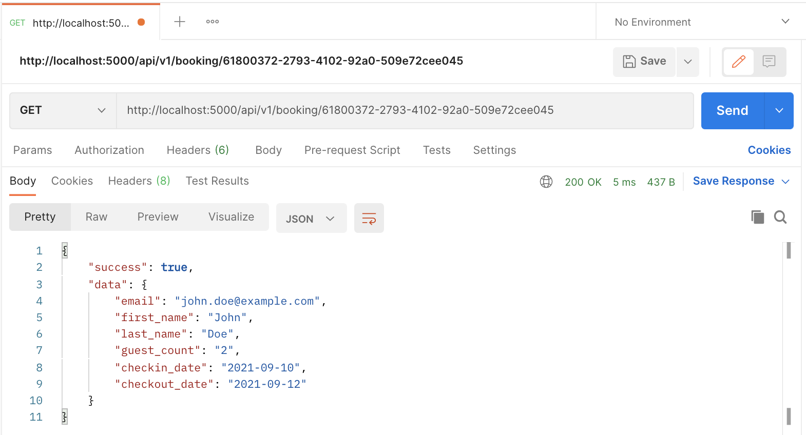
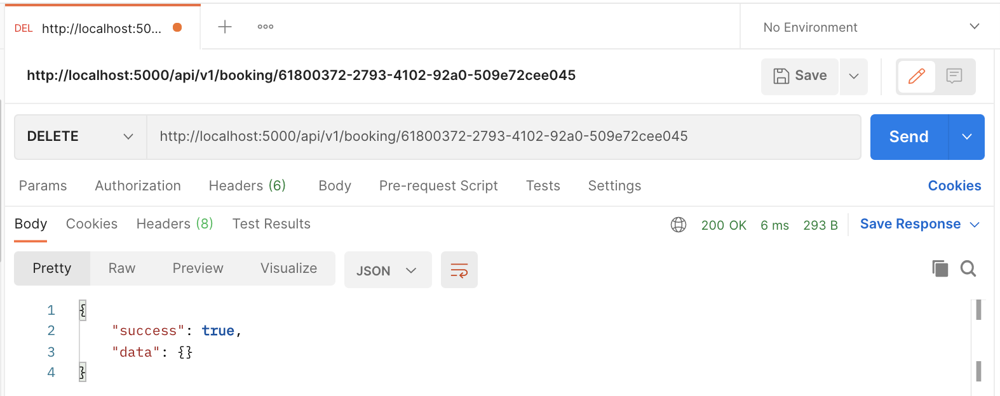

# Panoramic Hotel Booking App

After the contagious pandemic is over, Panoramic Hotel is now accepting booking of its only presidential suite. This Panoramic Hotel Booking App provides RESTful APIs with which the guests can book, view, or delete their hotel booking. 

## Description

This Panoramic Hotel Booking App is a headless app, which means there is no UI to interact with. The HTTP requests to the app can be made using CURL, Postman, or other similar tools. The response to the RESTful API request is provided in JSON format. The app is fundamentally built using NodeJS and ExpressJS.

## Getting Started

### Built With

1. Programming language

The app is primarly coded in JavaScript and make use of ES5/ES6 style of coding.

2. Framework

The app uses NodeJS and ExpressJS (https://expressjs.com) framework to design the RESTful API application.

3. Database

The app uses in-memory database JavaScript library called HashmapJS (https://www.npmjs.com/package/hashmap). The database only holds data until app is running. Upon stopping the app all data is lost. 

4. Unique ID generator

To generate universal unique booking ids, the app make use of NPM package called UUID (https://www.npmjs.com/package/uuid).

5. Date-time formatting

In order to manage date and do timestamp formatting, the app make use of MomentJS (https://www.npmjs.com/package/moment-timezone).

6. Testing framework

The app make use of testing frameworks such as Mocha, Chai, Sinon, and Nyc for the TDD, BDD, and code coverage testing.

### Dependencies

* body-parser
* cors
* http-errors
* morgan
* nodemon

### Dev Dependencies

* chai
* chai-http
* mocha
* nyc
* rootpath
* sinon

### Prerequisites

The app requires NodeJS and NPM to be installed on the system where this application will run.

* Verify if NodeJS and NPM is already installed on your system by executing following commands from the terminal. If installed then it will output the version number.

  ```sh
  node --version
  ```

  ```sh
  npm --version
  ```

* Otherwise, download and install NodeJS v15.0.0 from https://nodejs.org/download/release/v15.0.0/ based on your system OS. This will also install NPM by default along with NodeJS.

### Installing

1. Clone the repo
   ```sh
   git clone https://github.com/jaspal-carleton/panoramic_hotel.git
   ```
2. Change directory to the project folder
   ```sh
   cd panoramic_hotel
   ```
3. Install NodeJS modules or packages
   ```sh
   npm install
   ```

### Executing program

1. Start the app by executing following npm command from inside the project folder
   ```sh
   npm start
   ```

### Testing

For testing you need to open two separate command terminals. On one terminal run the app and use other terminal to test the app. 

1. Start the app in one of the command terminal by executing following npm command from inside the project folder
   ```sh
   npm start
   ```

2. To run the test cases, open another command terminal and execute following npm command from inside the project folder
   ```sh
   npm run test
   ```

3. To check the test coverage, execute following npm command from inside the project folder
   ```sh
   npm run coverage
   ```

## Usage

### Supported APIs

| Endpoint            | Request | API-URL                                   | Description                                        |
|---------------------|---------|-------------------------------------------|----------------------------------------------------|
| /api/v1/booking     | POST    | http://localhost:5000/api/v1/booking      | Create new booking as per HTTP POST body form data |
| /api/v1/booking/:id | GET     | http://localhost:5000/api/v1/booking/:id  | Fetch booking details using booking id             |
| /api/v1/booking/:id | DELETE  | http://localhost:5000/api/v1/booking/:id  | Delete booking using booking id                    |

### Schema of HTTP POST Request Body Object

```JS
{
    "email": "<email id of principal guest>",
    "first_name": "<first name of principal guest>",
    "last_name": "<last name of principal guest>",
    "guest_count": "<number of people or guests including principal guest>",
    "checkin_date": "<hotel booking check-in date>",
    "checkout_date": "<hotel booking check-out date>"
}
```

Example
```JS
{
    "email": "john.doe@example.com",
    "first_name": "John",
    "last_name": "Doe",
    "guest_count": 2,
    "checkin_date": "2021-09-10",
    "checkout_date": "2021-09-12"
}
```

### Data Type and Value Constraints

* Following constraints apply to HTTP POST Request Body Object

| Attribute     | Data Type | Constraint                                          |
|---------------|-----------|-----------------------------------------------------|
| email         | String    | Email ID in valid and acceptable format             |
| first_name    | String    | Valid Unicode string with more than one characters  |
| last_name     | String    | Valid Unicode string with more than one characters  |
| guest_count   | Number    | Minimum one and maximun three guests allowed        |
| checkin_date  | String    | Date in YYYY-MM-DD format should be future date     |
| checkout_date | String    | Date in YYYY-MM-DD format should be future date     |

* Maximum of three days allowed for hotel booking

### Response Object

* Sample Success response after creating new booking

```JS
{
    "success": true,
    "data": {
        "booking_id": "61800372-2793-4102-92a0-509e72cee045",
        "email_id": "john.doe@example.com",
        "retrive_booking": {
            "http_method": "GET",
            "api_endpoint": "/api/v1/booking/:booking_id",
            "full_url": "http://localhost:5000/api/v1/booking/61800372-2793-4102-92a0-509e72cee045"
        },
        "cancel_booking": {
            "http_method": "DELETE",
            "api_endpoint": "/api/v1/booking/:booking_id",
            "full_url": "http://localhost:5000/api/v1/booking/61800372-2793-4102-92a0-509e72cee045"
        }
    }
}
```


* Sample Success response after fetching exisitng booking

```JS
{
    "success": true,
    "data": {
        "email": "john.doe@example.com",
        "first_name": "John",
        "last_name": "Doe",
        "guest_count": "2",
        "checkin_date": "2021-09-10",
        "checkout_date": "2021-09-12"
    }
}
```



* Sample Success response after deleting exisitng booking

```JS
{
    "success": true,
    "data": {}
}
```




## Test Results

* Following are the list of test cases written for the app


* The test coverage for the app is shown below


## Author

Jaspal Singh

Project Link: https://github.com/jaspal-carleton/panoramic_hotel

## License

This project is licensed under the MIT License - see the LICENSE file for details
